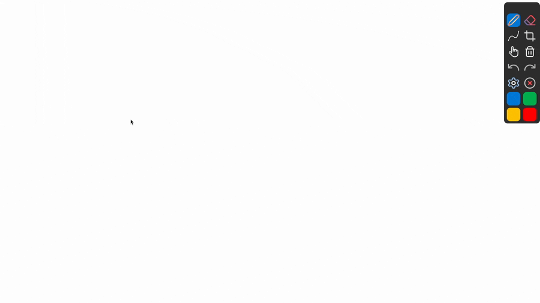

# Stroke Recognition

## Genel Bakış

Stroke Recognition özelliği, kullanıcı tarafından çizilen serbest el çizimlerini otomatik olarak geometrik şekillere dönüştürür.

Desteklenen şekiller:

- Düz Çizgi
- Üçgen
- Kare
- Daire

## Demo

  

---

## Özellikler

- Serbest çizimleri otomatik algılar.
- Çizimi ideal geometrik şekle dönüştürür.
- Dolu ve boş şekilleri destekler.
- Mevcut çizim araçlarıyla uyumludur.
- Açılıp kapatılabilir.

---

## Algoritma

Algoritma aşağıdaki adımlardan oluşmaktadır.

### Yeniden Örnekleme (Resampling)

resample() fonksiyonu, kullanıcının çizdiği ham noktaları sabit sayıda ve eşit aralıklı noktalara dönüştürür. Çizim hızı örnek sayısını etkileyebileceği için, tüm çizimler ortak bir gösterime dönüştürülmeden doğrudan karşılaştırılamaz.

Fonksiyon ilk olarak çizimin toplam uzunluğunu hesaplar. Ardından bu uzunluğu kullanarak örnekleme aralığını belirler ve çizgi boyunca eşit mesafelerde yeni noktalar oluşturur. Sonuç olarak her çizim, hızından bağımsız olarak `RESAMPLE_POINTS` adet nokta ile temsil edilir.

Bu adım, sonraki aşamalarda gerçekleştirilen açı hesaplamalarının, köşe tespitinin ve şekil sınıflandırmasının daha tutarlı çalışmasını sağlar.

### Köşe Düzeltme

fixPointsForIntersection fonksiyonu, yeniden örnekleme işlemi sonrasında köşe noktaları, çizginin gerçek kesişim noktasından sapmış olabilir. Bu durum özellikle kare ve üçgen gibi keskin köşeli şekillerde açı ve kenar hesaplarını olumsuz etkileyebilir.

Bu adımda, komşu kenarların uzantılarının kesişim noktaları hesaplanarak köşe noktaları bu konumlara taşınır. Böylece şekil geometrik olarak daha doğru temsil edilir ve sonraki puanlama aşamalarında daha güvenilir sonuçlar elde edilir.

### Yön ve Yön Değişimlerinin Hesaplanması

Bu adımda, yeniden örneklenen noktalar kullanılarak ardışık her doğru parçasının yön açısı (`theta`) hesaplanır. Daha sonra ardışık yön açıları arasındaki fark alınarak dönüş açıları (`delta theta`) elde edilir.

Elde edilen `delta theta` değerleri, çizim boyunca gerçekleşen yön değişimlerini temsil eder ve köşe tespiti ile şekil sınıflandırmasının temelini oluşturur.

### Köşe Tespiti

Köşeler, ardışık yön açıları arasındaki değişim (`delta theta`) kullanılarak belirlenir. Öncelikle belirlenen eşik değerinin üzerindeki yön değişimleri aday köşe olarak işaretlenir.

Bir köşeye ait yön değişimi tek bir noktada gerçekleşmeyebilir. Kullanıcının çizim şekline bağlı olarak aynı köşe birkaç ardışık noktaya yayılabilir. Bu nedenle birbirine yakın aday noktalar tek bir dönüş bölgesi altında birleştirilir.

Her dönüş bölgesi, başlangıç ve bitiş indeksleri ile birlikte saklanır. Bu bölgeler daha sonra köşe sayısının belirlenmesi, kenarların oluşturulması ve şekil puanlamasında kullanılır.

### Özellik Çıkarımı

Köşe tespitinin ardından çizimi tanımlayan geometrik özellikler hesaplanır. Bu aşamada toplam dönüş açısı, mutlak dönüş açısı, toplam çizim uzunluğu, doğrusallık (straightness), yön değişimi sayısı, köşe sayısı ve gürültü seviyesi gibi özellikler elde edilir.

Bu özellikler, çizimin her şekle ne kadar benzediğini değerlendiren puanlama algoritmalarına giriş olarak kullanılır.

### İdeal Şeklin Oluşturulması (Shape Fit)

Kare ve üçgen için, her iki köşe bölgesi arasında kalan noktalar ilgili kenarı temsil eder. Her kenarın yönü, bu noktaların oluşturduğu doğrultunun ortalama açısı kullanılarak hesaplanır. Elde edilen kenarlar kullanılarak ideal üçgen veya kare oluşturulur ve kullanıcının çizimi bu ideal şekil ile karşılaştırılır.

Daire için ise yeniden örneklenen noktalar kullanılarak en uygun merkez ve yarıçap hesaplanır. Noktaların bu ideal çembere olan uzaklıkları değerlendirilerek Shape Fit puanı elde edilir.

### Şekil Puanlaması

Her şekil için farklı geometrik özellikler değerlendirilerek 0 ile 100 arasında bir puan hesaplanır. Örneğin çizgi için doğrusallık ve yön değişimi sayısı ön plandayken, kare ve üçgen için köşe sayısı, Shape Fit ve kapanma durumu daha yüksek ağırlığa sahiptir. Çember için ise toplam dönüş açısı, yarıçap tutarlılığı ve Shape Fit birlikte değerlendirilir.

Bu sayede her çizim, tüm şekiller açısından ayrı ayrı puanlanır.

| Şekil | Temel Özellikler                          |
| ----- | ----------------------------------------- |
| Çizgi | Straightness, Direction Change, Noise     |
| Üçgen | Turn Regions, Closure, Shape Fit          |
| Kare  | Turn Regions, Closure, Shape Fit          |
| Daire | Total Turn, Radius Consistency, Shape Fit |

### Karar Verme

Tüm şekiller için hesaplanan puanlar karşılaştırılır. En yüksek puana sahip şekil, belirlenen eşik değerin üzerinde ise tanıma sonucu olarak seçilir. Hiçbir puan eşik değerini geçemezse çizim herhangi bir şekil olarak sınıflandırılmaz.

## Pardus Pen Entegrasyonu

Şekil tanıma algoritması, kullanıcı çizimi tamamladığında `DrawingWidget` içerisinde çalıştırılır. Tanıma sonucunda herhangi bir şekil tespit edilirse, kullanıcının çizdiği serbest çizim silinir ve yerine hesaplanan ideal şekil eklenir. Şekil tanınamazsa çizim herhangi bir değişiklik yapılmadan korunur.

Bu yaklaşım sayesinde kullanıcı normal şekilde çizim yapmaya devam ederken, yalnızca yeterli güven seviyesine ulaşan çizimler otomatik olarak düzgün geometrik şekillere dönüştürülür.

### Geri Alma Desteği

Şekil tanıma sonrasında kullanıcı tarafından çizilen serbest çizim doğrudan silinmez. Öncelikle orijinal çizim geri alma (Undo) geçmişine kaydedilir. Böylece kullanıcı istediği zaman geri alma işlemini kullanarak otomatik oluşturulan şekli kaldırabilir ve kendi çizdiği serbest çizime geri dönebilir.

Bu yaklaşım, şekil tanımanın kullanıcı üzerinde geri alınamaz bir değişiklik oluşturmasını engeller ve mevcut geri alma sistemi ile uyumlu çalışmasını sağlar.

### Kullanıcı Arayüzü

Şekil tanıma özelliğinin kontrol edilebilmesi için arayüze yeni seçenekler eklenmiştir. Kullanıcı isterse şekil tanımayı etkinleştirebilir veya devre dışı bırakabilir. Ayrıca desteklenen şekiller için dolu ve çerçeve çizim seçenekleri de arayüz üzerinden kullanılabilir.

Bu sayede özellik, mevcut çizim araçlarıyla bütünleşik şekilde çalışırken kullanıcının tercihine göre kolayca açılıp kapatılabilir.

---

## Kaynaklar

Algoritma geliştirilirken aşağıdaki kaynaklardan yararlanılmıştır.

Wobbrock, Wilson, Li - $1 Recognizer

Li - Protractor: A Fast and Accurate Gesture Recognizer

Sezgin et al. - Sketch Based Interfaces

---

## Gelecek Çalışmalar

- Kullanıcıya göre adaptif tolerans değerleri
- Daha fazla çokgen desteği